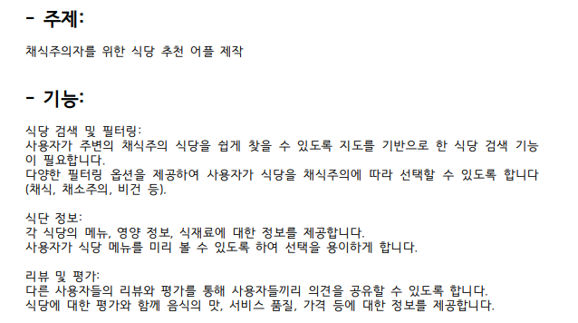

# <font color="green"> <b> ji-vegan </b> </font>

<br>

* 채식주의자, 특정 종교인(이슬람권, 힌디권) 포함

## 개발환경(windows 64bit)
* Frontend
  * VueJS
* Backend
  * Spring Boot 
* DB
  * Postgresql
<br>

## 개발환경 세팅
* [Frontend 환경] NodeJS 설치(64bit)
  * version = v18.16.0 : [다운](https://nodejs.org/dist/v18.16.0/node-v18.16.0-x64.msi) 
  * env 파일 설정 방법. 
    * VITE_MAP_KEY: 네이버 클라우드 지도 API 키 (**API 키 등록 방법**)
      * (중요) API 키 등록이 되지 않으면, 사용자 페이지에서 지도가 보여지지 않음.
    
* [API 키 등록 방법]
  * [네이버 클라우드 플랫폼](http://www.ncloud.com)에 접속 후 "회원가입" 및 "결제방법" 등록
    * 유료 상품을 이용하기 전까지, 월 리소스 사용 데이터 초과 전까지는 무료로 이용 가능
  * [네이버 MAP 서비스](https://www.ncloud.com/product/applicationService/maps)에 접속 후 "이용 신청하기" 클릭
    * 콘솔에서 application 등록
    * PC 웹에서 사용하는 경우이므로, Web Dynamic Map 선택
    * 도메인은 "DEV" 모드에서 5173번 포트, "PRODUCTION" 모드에서 5001번 포트
      <br>
      

    * 도메인 등록 완료 후, 인증 정보에서 Client 시크릿 키 복사 -> 이 키가 곧 VITE_MAP_KEY
  * [API 키 등록 방법 참조](https://sorrow16.tistory.com/188)
  
* [Backend 환경] Java(17) 설치(64bit)
  * version = JDK 17 : [다운](https://download.oracle.com/java/17/latest/jdk-17_windows-x64_bin.exe)
  * 개발환경 세팅 참고 (https://yungenie.tistory.com/11)

* [Database 환경] Postgresql 설치(Windows x86-64)
  * version = v16.1 : [다운](https://sbp.enterprisedb.com/getfile.jsp?fileid=1258792)
  * **(주의)** 비밀번호 설정 => **1111**
    <br>
  

* [개발 환경] IntelliJ IDEA Community Edition 설치(64bit)
  * IntelliJ IDEA Community Edition : [다운](https://www.jetbrains.com/ko-kr/idea/download/download-thanks.html?platform=windows&code=IIC) 
    
<br>

## 구동방법(http://localhost:5001)
### dev 모드
* Frontend
  * /ji-vegan/frontend 폴더 이동
  * npm install
  * npm run dev

    
* Backend
  * /ji-vegan/backend 폴더 이동
  * intellij > BackendApplication.java main 실행
  
### production 모드
* Frontend
    * /ji-vegan/frontend 폴더 이동
    * npm install
    * npm run build

* Backend
    * /ji-vegan/backend 폴더 이동
    * intellij > bootJar 실행
    * /ji-vegan/backend/build/libs 폴더 이동 backend-0.0.1-SNAPSHOT.jar 파일 확인
    * powershell 창에서 실행 > java -jar backend-0.0.1-SNAPSHOT.jar

### 통합 모드
* Frontend + Backend
  * /ji-vegan/bin 폴더 이동
  * powershell 창에서 실행 > java -jar backend-0.0.1-SNAPSHOT.jar
  
<br>

## 기능요구사항
```
1. 사용자 로그인(일반 사용자/ 관리자) 페이지
	1.1 회원가입(일반 사용자) 기능(* 사용자 DB 업데이트 예정)
	1.2 로그인 기능(아이디, 비밀번호)
		1.2.1 JWT Token 발급 + 인증
		1.2.2 사용자 Role 별 메뉴 기능(payload 내부 Role 참조 => Role.ADMIN, Role.User)
		1.2.3 로그인 연장 기능(token 갱신)
	1.3 회원정보 수정
	1.4 로그아웃

2. 관리자 페이지
	2.1 음식점 검색 기능(*검색 필드 업데이트 예정)
	2.2 음식점 추가 기능(사진, 주소, 위도, 경도, 카테고리 등등)
		2.2.1 구글 맵 또는 주소 검색 입력 팝업을 통해서 자동 입력 필요
	2.3 음식점 수정(상세보기) 기능(리뷰 및 별점)
	2.4 음식점 삭제 기능
	
3. 일반 사용자 대시보드 페이지(구글 지도 화면 + 음식점 목록)
	3.1 현재 위치 기반 구글 지도 표시
	3.2 현재 위치 기반 구글 지도에 보이는 음식점 목록 표시
	3.3 검색, 필터 기능
	3.4 구글 지도 위 마커 표시
	3.5 구글 지도 위 마커 선택 후 음식점 상세보기
	3.6 음식점 리뷰 및 평점 기능
	
4. 추가 예정
	4.1 단계별 채식주의자 안내 표시(dosc/표 테이블 참조)
	
```

## DB Table 구조

## REST API
- GET
  | URL | 의미  | 비고||
    |---|:---:|---:|---:|
  | `/api/user` | 사용자 목록 조회 ||
  | `/api/user/{id}` | 사용자 상세조회 | id = int |
  | `/api/shop` | 음식점 목록 조회 ||
  | `/api/shop/{id}` | 음식점 상세조회 | id = int |
  | `/api/shop/{id}/menu` | 음식점 메뉴 조회 | id = int |
  | `/api/shop/{id}/review` | 음식점 리뷰 조회 | id = int |
  | `/api/menu` | 메뉴 목록 조회 ||
  | `/api/menu/{id}` | 메뉴 상세조회 | id = int |
  | `/api/review` | 리뷰 목록 조회 ||
  | `/api/review/{id}` | 리뷰 상세조회 | id = int |
  | `/images/_shop/{name}` | 음식점 이미지 조회 | name = string(파일이름) |
  | `/images/_menu/{name}` | 메뉴 이미지 조회 | name = string(파일이름) |
  | `/images/_review/{name}` | 리뷰 이미지 조회 | name = string(파일이름) |
  |||||
  
- POST
  | URL | 의미  | 비고||
    |---|:---:|---:|---:|
  | `/login` | 사용자 로그인 |**인증없음**|
  | `/signup` | 사용자 회원가입 |**인증없음**|
  | `/api/user` | 사용자 추가 ||
  | `/api/token/check` | 토큰 유효성 검사 ||
  | `/api/shop` | 음식점 추가 ||
  | `/api/menu` | 메뉴 추가 ||
  | `/api/review` | 리뷰 추가 ||
  |||||

- PUT
  | URL | 의미  | 비고||
    |---|:---:|---:|---:|
  | `/api/user/{id}` | 사용자 수정 | id = int |
  | `/api/shop/{id}` | 음식점 수정 | id = int |
  | `/api/menu/{id}` | 메뉴 수정 | id = int |
  | `/api/review/{id}` | 리뷰 수정 | id = int |
  |||||
  
- DELETE
  | URL | 의미  | 비고||
    |---|:---:|---:|---:|
  | `/api/user/{ids}` | 사용자 삭제 | ids = int[] |
  | `/api/shop/{ids}` | 음식점 삭제 | ids = int[] |
  | `/api/menu/{ids}` | 메뉴 삭제 | ids = int[] |
  | `/api/review/{ids}` | 리뷰 삭제 | ids = int[] |
  |||||


